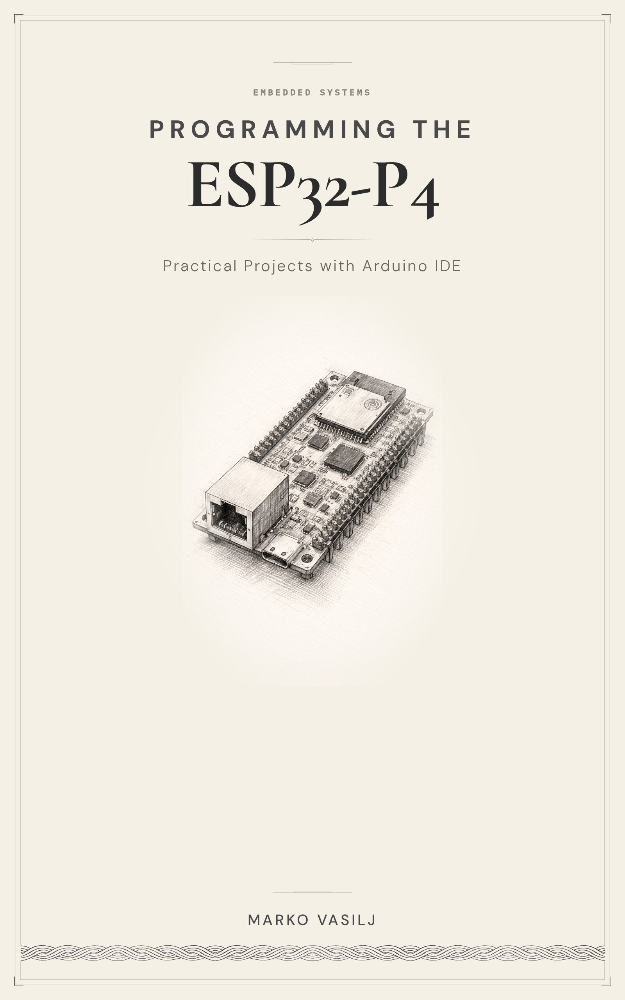

  

# ESP32-P4 Arduino Projects

A collection of Arduino sketches for the ESP32-P4 — Espressif's most powerful chip. Dual-core 400 MHz RISC-V, 16–32 MB PSRAM, MIPI-DSI display, USB 2.0 OTG, and hardware AI acceleration. No WiFi. No Bluetooth. All radio work is delegated to a companion ESP32-C6 over SDIO — a fundamentally different architecture from every other ESP32.

These **36 working projects** take you from first blink to TensorFlow Lite person detection, covering:

- **Display & UI** — MIPI-DSI initialization, SPI displays (LovyanGFX + ILI9488), LVGL fundamentals, multi-screen dashboards, multitouch
- **Connectivity** — WiFi (STA mode with config portal), BLE scanning, Ethernet (W5500 SPI + native RMII), MQTT
- **Sensors** — I2C scanning, DHT11, BME280, BH1750, MPU6050
- **Peripherals** — SD card, audio output/input, USB host, NTP clock, deep sleep, NVS persistent storage with CRC32
- **Advanced** — FreeRTOS dual-core architecture, camera, WiFi streaming, TFLite inference, FFT signal analysis with ESP-DSP, marble maze game

Every sketch was compiled, uploaded, and tested on real hardware. The code works. When it doesn't (because the P4 ecosystem is young and moving fast), it's documented honestly — including what doesn't work and why.

*Build things. Break things. Learn from both.*

## Repository Structure

### `chapters/`
Projects organized by topic. Each folder includes the target board in its name (`_crowpanel`, `_tab5`, or `_p4eth`).

| # | Project | Board |
|---|---------|-------|
| 02 | Development Environment Setup | CrowPanel |
| 03 | P4 Architecture | CrowPanel |
| 04 | Hello World Display | CrowPanel |
| 05 | LVGL Fundamentals | CrowPanel |
| 06 | LED Control | CrowPanel |
| 07 | WiFi Scanner | CrowPanel |
| 08 | BLE Scanner | CrowPanel |
| 09 | Ethernet (W5500 + RMII) | CrowPanel |
| 10 | WiFi AP & Web Server | CrowPanel |
| 11 | MQTT | CrowPanel |
| 12 | I2C Scanner | CrowPanel |
| 13 | DHT11 Temperature/Humidity | CrowPanel |
| 14 | BME280 Environmental Sensor | CrowPanel |
| 15 | BH1750 Light Sensor | CrowPanel |
| 16 | MPU6050 Accelerometer/Gyro | CrowPanel |
| 17 | NTP Clock | CrowPanel |
| 18 | SD Card | CrowPanel |
| 19 | Audio Output | CrowPanel |
| 20 | Audio Input | CrowPanel |
| 21 | Dashboard | CrowPanel |
| 22 | Multitouch | CrowPanel |
| 23 | FreeRTOS Dual-Core | CrowPanel |
| 24 | Deep Sleep | CrowPanel |
| 25 | USB Host | CrowPanel |
| 26 | Camera | Tab5 |
| 29 | TFLite Person Detection | Tab5 |
| 30 | WiFi Camera Stream | Tab5 |
| 31 | Marble Maze | Tab5 |
| 32 | SPI Displays (LovyanGFX + ILI9488) | P4-ETH |
| 33 | Native RMII Ethernet (IP101 PHY) | P4-ETH |
| 34 | NVS Persistent Storage with CRC32 | Any P4 |
| 35 | FFT Signal Analysis with ESP-DSP | P4-ETH |
| 36 | AI-Assisted ESP32-P4 Development | Any P4 |

> **Note:** Folders 01, 27, and 28 are not included — those are reference topics (Meet the P4, What Doesn't Work, Prototype to Product) with no code.

### `extras/`
Standalone reference sketches for the CrowPanel ESP32-P4, Waveshare P4-ETH, and M5Stack Tab5.

### `skills/`
Claude Code skill for AI-assisted ESP32-P4 development. Install Claude Code, clone this repo, and the skill activates automatically. See project 36.

### `docs/`
Additional reference documentation.

## Supported Hardware

All sketches are tested on real boards:

- **Elecrow CrowPanel Advanced 7" ESP32-P4** — primary board, projects 02–25
- **M5Stack Tab5** — projects 26, 29, 30, 31
- **Waveshare ESP32-P4-ETH** — projects 32–33, 35

## Requirements

- Arduino IDE 2.x
- ESP32 Arduino Core 3.2.6+
- ESP32_Display_Panel v1.0.4+ (CrowPanel/Tab5 projects)
- LovyanGFX (P4-ETH display projects)
- LVGL v9.2.x (with included `lv_conf.h` — see `docs/lv_conf.h`)
- ESP-DSP library (project 35)

## Attribution

This project was built by consulting the internet many times — forum posts, GitHub issues, library source code, and blog posts written by people who had already fought the same battles. I have done my best to attribute all third-party code and ideas to their rightful authors. If, despite my efforts, I have copied, adapted, or built upon your work without providing proper attribution, please contact feedback@magicsmokepress.com. I will gladly add the appropriate credit or remove the material — no takedown notice needed, just a friendly email.

## Support

If this code helped you build something, learn something, or saved you from staring at a blank screen for another hour — you can say thanks:
- **Buy the book:** [smokemagic.gumroad.com/l/yfcnzu](https://smokemagic.gumroad.com/l/yfcnzu)
- **PayPal:** [paypal.me/magicsmokepress](https://paypal.me/magicsmokepress)
- **Buy me a coffee:** [buymeacoffee.com/magicsmokepress](https://buymeacoffee.com/magicsmokepress)

Either way, go build something. That's the best thank you.

## 🇭🇷

Za vas par koji ste se našli tu, slučajno ili ne — pretpostavljam da znate engleski da ste pročitali sve gore navedeno. Ako ne, javite mi se pa ću to napisati i na "naški." Ali ozbiljno, ako ste iz Hrvatske, Bosne & Hercegovine, Srbije ili Crne Gore i želite izdanje na naškom možda bude. Razumijemo se — bez obzira dal je ova knjiga lijepa, ljepa, lipa ili lepa. Javite se.

## License

Copyright (c) 2026 Marko Vasilj. The code in this repository is released under the [MIT License](LICENSE) — you are free to use, modify, and distribute it. The only requirement is that you comply with the licenses of the third-party libraries the sketches depend on (LVGL, LovyanGFX, ESP-DSP, PubSubClient, etc.). See the LICENSE file for details.

Written with AI assistance. All code tested on real hardware by a human.
